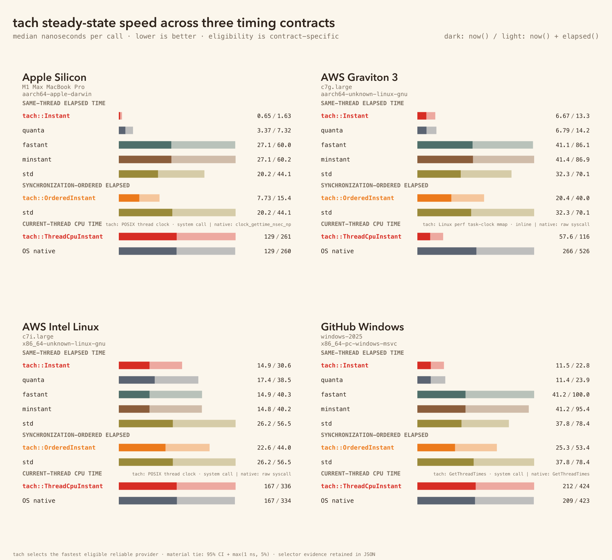
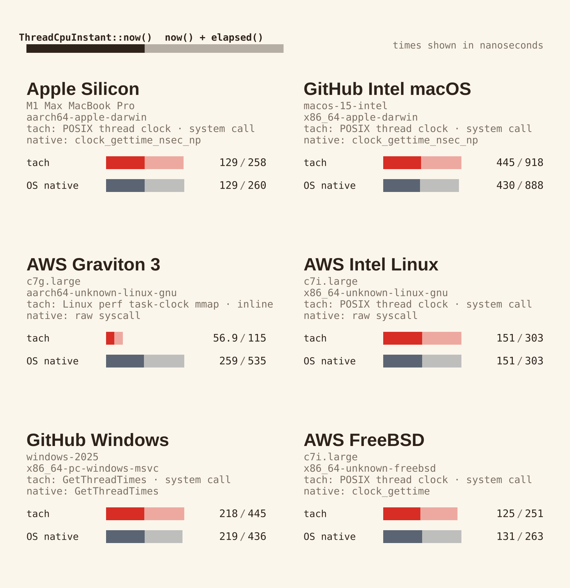

# tach benchmark evidence

tach's release proof separates two claims:

- A warning-strict, optimized build proof covers all 24 advertised Rust targets and every default
  and `--no-default-features` provider route. That proves availability, routing, and hot-path
  shape—not latency on hardware we did not run.
- A retained runtime campaign covers 15 distinct provider-selection, host-availability, and native
  representative boundaries. Six native full-speed cells are shown below; the other nine prove
  Wasm, Emscripten, WASI, fallback, and smoke boundaries without turning them into native speed
  claims.

The complete release validator admits 4 primary and 11 supplemental artifacts with zero failures.
Artifacts came from revisions
[`68dc201`](https://github.com/spence/tach/commit/68dc2015bbb81e16b9a1911c566b52aca8ff1c77)
and [`c64dcb7`](https://github.com/spence/tach/commit/c64dcb732723c6cf288c6a453545bfc00f6b2b5d),
whose `Cargo.lock`, `Cargo.toml`, and `src/` trees have the identical
`7f888cd0e4ed668a4ecdd6cacb1af3dbe1749ce57d2b17e86c1988103d2f5771` digest.

Every value below is nanoseconds per call; lower is better. Each pair is
`now() / (now() + elapsed())`.

“Fastest tested” means tach is faster than or materially tied with every reference eligible for
that timer's contract on that platform. The predeclared material-tie band is `max(1 ns, 5%)`.
Both tach's point estimate and conservative 95% confidence-interval comparison must fit inside
that band. Faster but contract-ineligible raw counters remain visible as diagnostics and do not
become competitors by weakening the contract.

## Combined chart



The chart renderer first runs the complete 15-boundary release gate, then reads only the captured
bytes admitted by that gate. It refuses mixed shipping code, missing boundaries, malformed
confidence intervals, unreproducible selectors, or failed eligible-reference comparisons.

## Same-thread elapsed time

The audited references are `quanta 0.12.6`, `fastant 0.1.11`, `minstant 0.1.7`, and
`std::time::Instant`; eligibility is platform- and contract-specific.

| Environment | tach | quanta | fastant | minstant | std |
|---|---:|---:|---:|---:|---:|
| Apple M1 Max | **7.79 / 15.47** | 3.34 / 7.30 † | 26.83 / 60.47 | 26.97 / 60.12 | 20.10 / 44.08 |
| GitHub Intel macOS | **25.12 / 47.68** | 137.56 / 203.06 | 51.02 / 109.89 | 48.26 / 111.56 | 47.28 / 105.58 |
| AWS Graviton 3 | **6.67 / 13.35** | 6.81 / 14.20 | 41.94 / 87.74 | 41.56 / 87.56 | 32.59 / 70.34 |
| AWS Intel Linux | **13.62 / 27.99** | 15.83 / 35.33 | 13.58 / 36.68 | 13.58 / 36.74 | 23.88 / 51.59 |
| GitHub Windows 2025 | **27.17 / 58.00** | 12.37 / 24.77 † | 45.51 / 104.50 | 45.49 / 104.40 | 41.24 / 85.42 |
| AWS FreeBSD | **13.91 / 28.79** | 15.89 / 35.48 | 39.49 / 89.51 | 39.52 / 89.42 | 31.31 / 65.43 |

† Superseded for Apple on 2026-07-15 (ADR-0005, `EVID-APPLE-BARE-CNTVCT`): the wake-correction
requirement was not part of the published `Instant` contract, and the bare counter passed the
same-thread monotonic/wall-rate battery on M1 Max and M4 Pro (0 violations in ~2.8e9 paired
reads). tach's Apple `Instant` now selects the bare architectural counter (post-adoption public
read 0.93 ns vs quanta 3.30 ns on the same M1 Max); the table above still shows the frozen
`76fd4b1` campaign and is refreshed in the six-cell re-measurement. On Windows the exclusion
stands: a process cannot establish the cross-core, hypervisor, migration, and platform-counter
properties Windows owns through QueryPerformanceCounter, and Windows documents no userspace TSC
invariance.

These are tight-loop throughput measurements. Independent architectural reads can overlap on an
out-of-order core; the results are not dependency-chained instruction latency.

## Synchronization-ordered elapsed time

`std::time::Instant` is the eligible synchronization-ordered public reference in this set.

| Environment | `tach::OrderedInstant` | `std::time::Instant` |
|---|---:|---:|
| Apple M1 Max | **7.74 / 15.42** | 20.10 / 44.08 |
| GitHub Intel macOS | **22.95 / 39.53** | 47.28 / 105.58 |
| AWS Graviton 3 | **20.65 / 40.76** | 32.59 / 70.34 |
| AWS Intel Linux | **20.62 / 40.12** | 23.88 / 51.59 |
| GitHub Windows 2025 | **27.17 / 58.15** | 41.24 / 85.42 |
| AWS FreeBSD | **22.43 / 43.07** | 31.31 / 65.43 |

Speed is only half this contract. The load-then-now-then-check harness separately recorded zero
inversions across about 10.9 billion x86 and AArch64 reads. See
[`benches/ORDERED-VERIFICATION.md`](benches/ORDERED-VERIFICATION.md). RISC-V and LoongArch use their
strongest ISA barriers but remain best-effort because their specifications do not guarantee that
those barriers order the time CSR.

## Current-thread CPU usage



The native reference invokes the same OS primitive directly. The selected-exact row measures the
provider tach installed, exposing TLS or dispatch overhead without treating a private route as a
caller-usable competitor.

| Environment | Selected tach provider | tach | OS native | Selected exact |
|---|---|---:|---:|---:|
| Apple M1 Max | `clock_gettime_nsec_np` | **128.90 / 258.18** | 128.54 / 260.41 | 128.33 / 257.41 |
| GitHub Intel macOS | `clock_gettime_nsec_np` | **444.51 / 918.12** | 429.77 / 888.46 | 444.50 / 914.71 |
| AWS Graviton 3 | Linux perf task-clock mmap | **56.95 / 114.68** | 259.34 / 535.21 | 57.81 / 116.26 |
| AWS Intel Linux | raw `CLOCK_THREAD_CPUTIME_ID` syscall | **150.75 / 302.94** | 150.87 / 302.62 | 150.92 / 304.81 |
| GitHub Windows 2025 | `GetThreadTimes` | **218.21 / 444.94** | 218.90 / 435.75 | 216.28 / 458.77 |
| AWS FreeBSD | raw `CLOCK_THREAD_CPUTIME_ID` syscall | **125.31 / 250.81** | 131.34 / 263.47 | 127.07 / 257.28 |

Linux AArch64 uses an audited availability policy: when the kernel exposes complete perf
task-clock mmap conversion metadata and architectural-counter access, tach selects that inline
route; otherwise it falls back to the raw thread-clock syscall. A retained c6g/c7g/c8g/t4g survey
found no same-target profitability reversal, so AArch64 does not pay for a startup tournament.

Linux x86 keeps runtime selection because the same Rust target has shown a real reversal. On this
`c7i.large`, perf access was available but slower, so tach selected the raw syscall. The tournament
measures complete candidate paths in nine alternating 4,096-read batches and changes provider only
after at least eight material wins.

The Windows baseline is `GetThreadTimes`, not `QueryThreadCycleTime`: Microsoft documents the
latter as cycles that must not be converted into elapsed time, which is a different quantity from
this API's `Duration` contract.

## Measured environments

| Environment | Runtime identity | Rust target | Harness |
|---|---|---|---|
| Apple Silicon | M1 Max MacBook Pro | `aarch64-apple-darwin` | Criterion |
| GitHub Intel macOS | `macos-15-intel` | `x86_64-apple-darwin` | Criterion |
| AWS Graviton 3 | `c7g.large` | `aarch64-unknown-linux-gnu` | Criterion |
| AWS Intel Linux | `c7i.large` | `x86_64-unknown-linux-gnu` | Criterion |
| GitHub Windows | `windows-2025` | `x86_64-pc-windows-msvc` | Criterion |
| AWS FreeBSD | `c7i.large`, FreeBSD 15 | `x86_64-unknown-freebsd` | Criterion |

The remaining admitted boundaries cover Node and browser Wasm, Emscripten default and pthread
modes, WASI preview 1 on Node and Wasmtime, WASI preview 2 on Wasmtime, `wasip1-threads`, and
`wasm32v1-none`. Tagged wall fallbacks and runtime smoke records prove availability only and are
never rendered as speed wins.

Every measured cell retains its source revision, build profile, enabled features, runner identity,
medians, confidence intervals, raw selector samples, and source-sealed collector bundle. The
durable package is
[`docs/evidence/timers/release-speed-closure-2026-07-14`](https://github.com/spence/tach/tree/v0.2.0/docs/evidence/timers/release-speed-closure-2026-07-14).
All temporary AWS instances and keys were removed after collection.

## Methodology

- Criterion cells use one-second warmup and three-second measurement windows and retain the point
  estimate plus 95% confidence interval for every benchmark.
- `now()` measures sample acquisition. The roundtrip measures `now()` followed by `elapsed()`,
  including the second read, subtraction, conversion, and `Duration` construction.
- Provider initialization is primed before measurement. Results describe steady-state cost, not
  first-call setup latency.
- Public references run in the same process and invocation. Runtime tournaments alternate
  candidates within paired batches so scheduling drift cannot masquerade as a provider win.
- Benchmarks are single-threaded hot-path throughput measurements, not contention or cross-machine
  accuracy measurements.

## Universal target and provider proof

The warning-strict proof compiles all three public APIs in default and
`--no-default-features` modes on 24 target triples, then inspects optimized LLVM IR for the
expected local, ordered, and thread-CPU provider routes. It closes 294 timer routes and their 294
paired `now()`/elapsed paths.

This proves that the APIs compile and route as documented. It does not assert relative latency on
unmeasured hardware. WASI thread-clock availability is host-dependent; browser, bare Wasm, and
Emscripten can expose an explicit monotonic-wall fallback for `ThreadCpuInstant`.

Run it with:

```sh
python3 benches/verify-target-providers.py --install-targets
```

## Reproduce the retained gate and charts

From a checkout of the release tag:

```sh
evidence=docs/evidence/timers/release-speed-closure-2026-07-14
scratch=$(mktemp -d)

(cd "$evidence" && shasum -a 256 -c SHA256SUMS)
cp "$evidence"/speed*.json "$evidence"/route-observations-v1.json "$scratch"/
tar -xzf "$evidence/collector-bundles.tgz" -C "$scratch"

python3 benches/validate-speed-evidence.py \
  --data-dir "$scratch" \
  --output "$scratch/release-report.json"
python3 benches/summary-use-cases.py --data-dir "$scratch" --output-dir benches --svg-only
python3 benches/summary-thread-cpu.py --data-dir "$scratch" --output-dir benches --svg-only
```

The renderers consume the full validated snapshot and refuse to render a primary-only subset.
SVG output is platform-independent. The checked-in PNGs are the canonical Ubuntu 24.04 release
rasters produced with `rsvg-convert 2.58.0`; newer local librsvg and font stacks may produce
visually equivalent but byte-different PNGs, so CI owns their byte-for-byte regeneration.
Recollecting a native cell uses the source-sealed runners in `benches/run-speed-aws.sh`,
`benches/run-speed-freebsd-aws.sh`, `benches/run-speed-local.sh`, and the hosted benchmark workflow.
