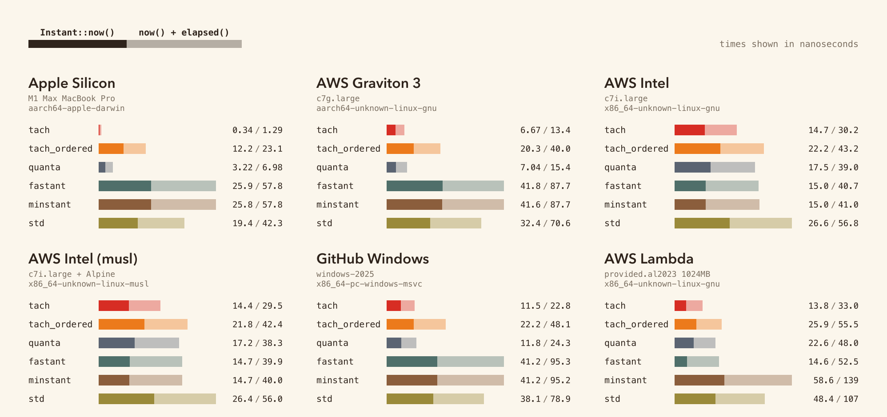

# tach

A replacement for `std::time::Instant` that reads the architectural counter directly: RDTSC on x86, CNTVCT_EL0 on aarch64, rdtime on riscv64 / loongarch64.

[](https://docs.rs/tach)
[](https://crates.io/crates/tach)

## usage

```rust
use tach::{Instant, MonotonicInstant, OrderedInstant};

// drop-in for std::time::Instant — fastest read (3.5–21 ns
// across platforms; 1.5–8× faster than std::time::Instant).
// Use this for the common case: pinned threads, or any code
// where ≤10 µs cross-thread sync slop is acceptable.
let start = Instant::now();
let elapsed = start.elapsed();

// same API, strict cross-thread monotonic by construction —
// guaranteed timeline across all threads even on platforms
// where the bare hardware counter has per-core sync slop.
// Use for tracing spans, multi-thread ordered logs, lock-free
// version numbers.
let mono = MonotonicInstant::now();
let elapsed = mono.elapsed();

// same API, sampled after prior Acquire loads — for
// correlating a timestamp with atomic synchronization state.
// Use when you need an explicit memory ordering barrier.
let ordered = OrderedInstant::now();
let elapsed = ordered.elapsed();
```

## choosing the right type

| Need | Reach for | Why |
|---|---|---|
| Fastest read, single-threaded or cross-thread with ≤10 µs slop OK | `Instant` | Bare counter read. Per-thread monotonic by hardware on every platform; cross-thread bounded by hardware sync floor. Best choice for most tracing/profiling/logging. |
| Guaranteed strict cross-thread monotonicity (spans crossing threads, multi-thread ordered logs) | `MonotonicInstant` | Adds one `AtomicU64::fetch_max` on platforms that need it (every multi-threaded target tested); zero-cost on wasm/WASI. |
| Acquire-load correlation with user atomics | `OrderedInstant` | Adds an arch-appropriate barrier (`rdtscp` on x86, `isb sy` on aarch64) before the counter read. |

Cost ordering, per-thread (no contention), as of 2026-05 (see `BENCHMARKS.md` for the full table): **`Instant` < `MonotonicInstant` < `OrderedInstant`**. Counterintuitive — `MonotonicInstant`'s LOCK fetch_max on an uncontended cache line is cheaper than `OrderedInstant`'s pipeline-drain barrier — but consistent across every cell we measure.

Bonus property of `OrderedInstant`: empirically passes strict cross-thread monotonicity on every cell we test (the pipeline-drain barrier serializes enough to close the cross-core race window). This is an *observation*, not an ISA guarantee. If you need cross-thread strictness guaranteed by construction, use `MonotonicInstant`. If you measure your target hardware and confirm `OrderedInstant` passes the strict test there, you can rely on it for both — but the safer default for the strict claim is `MonotonicInstant`.

## benchmark



Methodology and per-target reports: [BENCHMARKS.md](BENCHMARKS.md).

## semantics

`Instant` is the fast read — `RDTSC` on x86, `mrs cntvct_el0` on aarch64, `rdtime` on RISC-V, `rdtime.d` on LoongArch, `Performance.now()` in wasm, `clock_gettime(CLOCK_MONOTONIC)` everywhere else. Wall-clock-rate, keeps ticking through park / suspension / descheduling. Same source across every thread in the process. The whole counter read is one instruction on every native target; no runtime dispatch.

**Per-thread monotonicity is hardware-guaranteed.** A pinned thread (or any thread the OS doesn't migrate between cores) sees a strictly non-decreasing sequence. Measured: 0 backward jumps across 33 billion reads on our 6-cell bench matrix (`benches/skewmono-*.json`).

**Cross-thread monotonicity is bounded by the hardware's per-core sync slop.** On x86 the per-core TSC is firmware-synchronized but can show sub-microsecond drift on migration; on aarch64 the spec says `cntvct_el0` is one global counter but Apple Silicon and Graviton 3 both show measurable per-core slop in practice (see BENCHMARKS.md for the per-cell strict-contract data). Empirically the slop sits at the bracket-filter floor (≤10 µs) on every cell tested — matching `std::time::Instant` on the same hardware, because `std` reads the same underlying counter. For most use cases (tracing, profiling, latency measurement, request budgets) ≤10 µs slop is fine. For uses where it isn't — strictly ordered cross-thread events — reach for `MonotonicInstant` (next section).

Within a single process, two `Instant`s captured on the same thread (or both on pinned threads) are strictly orderable. Untested cross-CCX (AMD Zen4) and multi-socket NUMA boundaries are outside the verification set; `std` doesn't help there either — same hardware counter through a slower path — so measure your hardware if you correlate timestamps across those.

Cost on the read: 3.5–21 ns across our test matrix vs `std::time::Instant::now()`'s ~20–60 ns (1.5–8× faster). Full per-platform breakdown in `## performance` below.

## strict cross-thread monotonicity

Plain `Instant` is bounded by the hardware's per-core sync slop. **Bare arch counter reads (`rdtsc`, `mrs cntvct_el0`) FAIL strict cross-thread monotonicity on every multi-threaded platform we tested.** Rates vary by orders of magnitude — sub-ppm on Nitro VMs, 12% on Apple Silicon M1 — but every platform shows non-zero contract violations under the strict load-then-now-then-check test (`measure_strict_cross_thread`, runnable as `cargo bench --bench skew` or as the `monotonic_strict_cross_thread` unit test). See `BENCHMARKS.md` "Strict cross-thread monotonicity (contract validation)" for the per-cell × per-clock data.

`MonotonicInstant` enforces strict cross-thread monotonicity in software where the bench data shows it's needed, and skips the enforcement where the platform's execution model already guarantees it:

```rust
let t1 = tach::MonotonicInstant::now();
// ... cross-thread work via channels, mutexes, atomics ...
let t2 = tach::MonotonicInstant::now();
assert!(t2 >= t1);   // always; no hardware-floor sync slop leaks through
```

**Algorithm**: every `now()` does the bare counter read; on platforms where the bare clock empirically fails the strict contract (every multi-threaded target — x86, aarch64, RISC-V, LoongArch), the read is followed by `AtomicU64::fetch_max(tsc, AcqRel)` against a process-global last-seen tick. The fetch_max forces the return to be `>=` every previously published value. On wasm32 (single-threaded JS realm with W3C HRT strict-monotonic spec) and WASI (single-threaded execution model with strict-monotonic spec), the enforcement is skipped — `MonotonicInstant::now()` compiles to **the same instruction as `Instant::now()`**, free of cost.

**Cost where enforcement applies**: ~+2–14 ns per call uncontended (one LOCK CMPXCHG-class atomic on a hot cache line). Under heavy contention (many threads simultaneously hammering `now()`) it can degrade to 100+ ns per call as the cache line bounces between cores. Plain `Instant` stays untouched for callers who want the fastest read and accept hardware-floor monotonicity.

**Counterintuitive performance note**: on every platform we measure, `MonotonicInstant::now()` is FASTER than `OrderedInstant::now()` per-thread (e.g. Apple Silicon: 7.0 ns vs 18.5 ns; Windows: 10.7 ns vs 25.4 ns). The pipeline-drain barrier `OrderedInstant` uses costs more than a LOCK fetch_max on an uncontended cache line. Atomics-should-be-expensive is the wrong intuition for this regime.

**Comparison crates**: `std::time::Instant`, `quanta`, `minstant`, `fastant` all read the same underlying hardware counter (or a kernel-mediated wrapper thereof). On the strict load-then-now test (`BENCHMARKS.md`), `std` happens to pass on every cell (the vDSO/syscall path serializes internally); `quanta` fails on every cell (bare counter read); `minstant` and `fastant` show mixed results by platform. Notably, `fastant` falls back to wall-clock `SystemTime` on non-Linux targets — this is structurally non-monotonic (NTP corrections can move it backward) and would break tracing-style code on macOS / Windows. `MonotonicInstant` is the only type in the comparison set that gives strict cross-thread monotonicity by construction.

## ordered reads

A plain counter read can be reordered earlier than a preceding `Acquire` load:

```rust
let deadline = scheduler.load(Ordering::Acquire);
let now = tach::Instant::now();   // may be sampled before `deadline` is observed
```

`mrs cntvct_el0` is a system-register read; `rdtsc` is not a serializing instruction. Memory fences don't constrain when either executes. `OrderedInstant` emits the per-arch barrier (`isb sy` on aarch64, `rdtscp` on x86 — Intel SDM Vol 2B specifies that `rdtscp` "waits until all previous instructions have executed and all previous loads are globally visible") before / as the counter read, restoring the order:

```rust
let deadline = scheduler.load(Ordering::Acquire);
let now = tach::OrderedInstant::now();   // sampled after `deadline`
```

Cost is ~5–20 ns more than `Instant::now()`. `OrderedInstant::as_unordered()` downgrades to a plain `Instant` for storage; the reverse is not provided.

On riscv64 (`fence iorw, iorw`) and loongarch64 (`dbar 0`) the strongest available memory barrier is used; whether memory fences constrain CSR reads is implementation-defined on those targets, so the guarantee is best-effort.

**Empirical bonus (not an ISA guarantee)**: across every cell we test, `OrderedInstant::now()` also passes the strict cross-thread monotonicity test — the pipeline-drain barrier serializes enough state that the cross-core race window closes. This is a *side effect* of the barrier, not promised by Intel/ARM specs. If you need *guaranteed* strict cross-thread monotonicity by construction, use `MonotonicInstant` (it's also cheaper). If you've measured your target hardware and confirmed `OrderedInstant` passes the strict test there, you can rely on it for both ordering and cross-thread strictness on that hardware.

## platform support

| Platform / target               | `Instant` clock                  |
|---------------------------------|----------------------------------|
| Linux (x86_64)                  | RDTSC                            |
| Linux (x86)                     | RDTSC                            |
| Linux (aarch64)                 | CNTVCT_EL0                       |
| Linux (riscv64)                 | rdtime                           |
| Linux (loongarch64)             | rdtime.d                         |
| macOS (aarch64)                 | CNTVCT_EL0                       |
| macOS (x86_64)                  | RDTSC                            |
| Windows (x86_64)                | RDTSC                            |
| Windows (aarch64)               | CNTVCT_EL0                       |
| wasm32 (browser / Node host)    | `Performance.now()`              |
| WASI (wasm32-wasip{1,2})        | `clock_time_get(MONOTONIC)`      |
| Unix / other                    | `clock_gettime(CLOCK_MONOTONIC)` |

The crate is `#![no_std]`. `wasm-bindgen` is the only dependency, pulled in only for `wasm32-unknown-unknown` and `wasm32v1-none` (the targets that go through `Performance.now()`).

## drift

`elapsed()` can diverge from true wall-clock time over long intervals. Drift is *per-interval* — a 1-minute measurement made 5 seconds into the process has the same drift as one made 100 days in. Numbers below assume room-temperature operation; rows marked kernel-corrected assume no NTP, with active discipline they drop another order of magnitude.

| Crate | 1-sec interval | 1-min interval | 1-hr interval | 1-day interval |
|---|---|---|---|---|
| `tach::Instant` (default, `#![no_std]`) | 1.6 µs | 11.1 µs | 668.9 µs | 16.1 ms |
| `tach::Instant` + `recalibrate-background` (**requires `std`**) | 1.4 µs | 13.9 µs | 13.9 µs | 13.9 µs |
| `tach::OrderedInstant` (default, `#![no_std]`) | 1.4 µs | 9.9 µs | 593.9 µs | 14.3 ms |
| `tach::MonotonicInstant` (default, `#![no_std]`) | 1.4 µs | 8.6 µs | 518.4 µs | 12.4 ms |
| `quanta::Instant` | 1.5 µs | 67.4 µs | 4.0 ms | 97.1 ms |
| `minstant::Instant` | 1.8 µs | 9.9 µs | 595.7 µs | 14.3 ms |
| `fastant::Instant` | 2.0 µs | 18.4 µs | 1.1 ms | 26.5 ms |
| `std::time::Instant` | 373 ns | 511 ns | 511 ns | 511 ns |

Numbers are cross-cell empirical medians measured on 6 platforms (Apple Silicon M1 MBP, AWS Graviton 3, AWS Intel t3.medium, AWS Intel m7i.metal-24xl bare-metal, AWS Lambda x86_64, GitHub Actions windows-2025). Per-cell breakdown and methodology in [BENCHMARKS.md](BENCHMARKS.md). On Intel x86 the architectural TSC frequency comes from CPUID leaf 15h when the host exposes it (Skylake+ Intel, Zen2+ AMD bare metal); on hosts that zero the leaf (Firecracker, Azure VMs, GitHub Windows runners) tach falls back to a 100 ms × 7-sample spin-loop calibration with hypervisor-preemption discard. On Linux aarch64 (Graviton 3 and similar) `cntfrq_el0` is firmware-published nominal — the underlying crystal can be 10–30 ppm off and the kernel never folds the NTP-corrected scaling factor back into it. Tach calibrates `cntvct_el0` against `clock_gettime(CLOCK_MONOTONIC)` at startup, which inherits the kernel's NTP-corrected vDSO scaling, so drift lands sub-ppm regardless of the underlying chip's crystal offset. Apple Silicon (macOS aarch64) reads `mach_timebase_info` directly — Apple measures the timebase per-die at manufacture, so no calibration is needed.

For long-running services that need wall-clock-correlated accuracy:

- **`tach::Instant::recalibrate()`** — manual, `#![no_std]`-compatible. Call from your own scheduler to re-derive scaling against the platform monotonic clock (`clock_gettime(CLOCK_MONOTONIC)` on Unix, `QueryPerformanceCounter` on Windows). Costs ~700 ms of spin-loop time per call (7 × 100 ms samples, preempted samples discarded). Works on every supported target including embedded and SGX.
- **`recalibrate-background` Cargo feature** — automatic. Spawns a background thread that re-measures the frequency every 60 seconds (configurable via `tach::set_recalibration_interval`) and EMA-blends the result into the cached scale (α ≈ 0.2 ≈ 5-sample averaging window), so a single noisy calibration window can't jolt the scale on virtualized hosts. **Requires `std`; incompatible with `#![no_std]` targets** (pulls in `std::thread` and `std::sync::OnceLock`). Active on every target that calibrates at startup: Intel x86 (Linux / Windows) and aarch64 Linux. Empirically improves drift where startup calibration accumulates error — AWS Lambda goes from 0.75 ppm baseline to 0.58 ppm with recal, m7i.metal-24xl bare metal goes from -3.25 ppm to -0.34 ppm. No-op on macOS (Apple writes the per-die timebase) and Windows aarch64 (`cntfrq_el0` is QPF-calibrated). On cells where startup calibration was already sub-ppm (t3.medium burst VM, c7g.4xlarge Graviton) the EMA's residual stays within noise of baseline.

Within a single process, two tach measurements are mutually consistent — drift only shows up when comparing against an external reference (NTP-disciplined wall clock, another process, etc.).

## performance

Per-thread call cost across our 6-cell bench matrix (single-thread tight loop, no contention):

| Platform | `Instant` | `MonotonicInstant` | `OrderedInstant` | `std::Instant` |
|---|---|---|---|---|
| Apple Silicon M1 (aarch64 macOS) | **3.5 ns** | 7.0 ns | 18.5 ns | 28.0 ns |
| Graviton 3 (aarch64 Linux, `c7g.4xlarge`) | **7.3 ns** | 10.6 ns | 26.1 ns | 37.7 ns |
| Intel Nitro VM (x86 Linux, `t3.medium`) | **14.4 ns** | 25.4 ns | 27.1 ns | 36.3 ns |
| Intel bare metal (x86 Linux, `m7i.metal-24xl`) | **8.5 ns** | 14.4 ns | 16.8 ns | 19.5 ns |
| AWS Lambda Firecracker (x86) | **21.2 ns** | 35.7 ns | 40.0 ns | 59.5 ns |
| Windows Server 2025 (x86) | **9.6 ns** | 10.7 ns | 25.4 ns | 36.3 ns |

`Instant` is **1.5–8× faster than `std::time::Instant`** on every platform. `MonotonicInstant` adds 2–14 ns over `Instant`; `OrderedInstant` adds 8–19 ns. Notably `MonotonicInstant` is **faster than `OrderedInstant`** on every cell — the LOCK fetch_max on an uncontended cache line is cheaper than the pipeline-drain barrier `OrderedInstant` uses. Counterintuitive but consistent.

These are uncontended per-thread costs. Under heavy contention (many threads simultaneously hammering `now()`), `MonotonicInstant`'s fetch_max can degrade to 100+ ns as the cache line bounces between cores; `Instant` and `OrderedInstant` keep their per-thread cost regardless of contention. If your use case has hundreds of threads emitting timestamps in tight loops, plain `Instant` (accepting the hardware-floor cross-thread slop) is the right choice for the hot path; reserve `MonotonicInstant` for cases where strict ordering across threads is load-bearing.

Source: `benches/skewmono-*.json` (regenerable via `bash benches/run-skewmono-aws.sh <cell> <instance-type>`).

## non-goals

- Clock-skew correction across machines. This is a per-process counter.

## msrv

Rust 1.85.

## license

MIT OR Apache-2.0.
